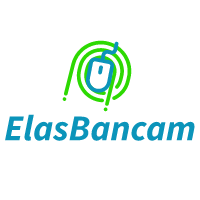

<div align="center">

</div>

# Projeto Integrador Programa ElaTech

Desenvolvimento de projeto integrado para o programa Elas Tech, uma parceria da PagBank PagSeguro com a Gama Academy.

# Contexto

O objetivo do projeto foi a criação de uma API para o funcionamento do nosso banco, o *ElasBancam*! Nessa API, desenvolvemos métodos ligados ao gerenciamento de clientes e a realização de transações entre contas, como: cadastro de novos clientes, busca pela lista completa de clientes ativos, realização de transações e a busca de transações por período.

# Regras e validações

Para garantir o cumprimento das regras de negócio, definimos algumas premissas:
- Todo cliente deve ser atrelado a uma conta bancária no momento do seu cadastro
- A conta bancária já deve ser criada com um valor inicial definido, mesmo que seja 0
- Não pode ser feito o cadastro de pessoa física com CPF ou RG já presentes no sistema
- Não pode ser feito o cadastro de pessoa jurídica com CNPJ ou Inscrição Estadual já presentes no sistema
- Todas as buscas por clientes devem retornar apenas aqueles que estão ativos no sistema


# Endpoints desenvolvidos

| Verbo | Endpoint | Parâmetro | Body |
|--------|--------------------|-----------------|-----------------|
| POST | /cliente/pj | N/A | Schema PessoaJuridica |
| POST | /cliente/pf | N/A | Schema PessoaFisica |
| GET | /clientes | {id} | N/A |
| GET | /clientes/todos | N/A | N/A |
| PUT | /cliente/pj | N/A | Schema PessoaJuridicaUpdate |
| PUT | /cliente/pf | N/A | Schema PessoaFisicaUpdate |
| PUT | /cliente/delete | {id} | N/A |
| POST | /transacoes | N/A | Schema Transacao|
| GET | /transacoes | {id} | N/A |
| GET | /transacoes/tipo | {tipoTransacao} | N/A |
| GET | /transacoes/periodo | {dataInicial}/{dataFinal} | N/A |
| GET | /transacoes/conta | {id} | N/A |


**Schemas**


# Organização de pastas


Estruturamos o nosso código definindo responsabilidades para cada package:
- **Config**: configurações necessárias para dependências 
- **Controllers**: métodos que tratam requisições da API e chamam ações dos services
- **DTOs**: modelos de schemas a serem seguidos ao fazer requisições na API  
- **Enums**: listas de valores aceitáveis em diferentes atributos do projeto
- **Exceptions**: arquivo de exceção que trata os erros do sistema
- **Models**: classes que representam as entidades do sistema, com atributos, construtores e getters e setters
- **Repositories**: interfaces que fazem o acesso direto ao banco de dados com queries padrão ou personalizadas
- **Services**: métodos que fazem as validações das regras de negócios e fazem requisições ligadas ao banco de dados para os repositories


# Ferramentas utilizadas

- Java 19 com module path
- Spring Boot 2.7.5
- Swagger
- Maven
- MySQL
- IntelliJ

*Para o gerenciamento do projeto, usamos o [Trello](https://trello.com/b/4cEiFZlD/gest%C3%A3o-de-projetos)*


# Rodando localmente

Para instalar o projeto na sua máquina, siga os passos abaixo:

1. Clone o repositório na sua máquina e o abra na sua IDE:
```
   https://github.com/mariseamorim/elas_bancam.git
```

2. Aguarde a instalação de todas as dependências.

3. Insira as informações do banco de dados que você deseja utilizar no arquivo *src/main/resources/application.properties*:
```
    spring.datasource.url= Caminho do Banco de Dados a ser usado, com a porta e o nome do BD a ser criado para este programa
    spring.datasource.username= Usuário
    spring.datasource.password= Senha
```
Obs.: usamos nas nossas máquinas o MySQL e nomeamos o BD de *elas_bancam*

4. Na sua IDE, selecione a opção de rodar o programa (através do arquivo *src/main/java/com.elasbancam/ElasbancamApplication*). Com esse comando, será feita a compilação de arquivos, o servidor será ligado e o banco de dados criado, com ajuda das dependências Spring Dev Tools e JPA, respectivamente.

5. No seu programa de Bancos de Dados, alimente o BD criado usando o script SQL contido no arquivo *src/main/java/resources/db/elas_bancam_dml.sql*.

Com o servidor rodando e as tabelas criadas e alimentadas, é possível consultar a documentação através do [Swagger](http://localhost:8080/swagger-ui/index.html#/)* e acessar plataformas como Postman ou Insomnia para fazer testes manuais e acessar dados da base de dados. Também .

**Atenção: caso mude a porta onde o projeto está rodando, mude essa informação também na url do Swagger*

# Autoras

- [Ana Flavia](https://github.com/anaflxvia)
- [Chrislanne Oliveira](https://github.com/Chrislanneo)
- [Laise France](https://github.com/LaiFrance)
- [Laura Neves](https://github.com/lmtfn)
- [Marise Amorim](https://github.com/nathalybarreto)
- [Nathaly Barreto](https://github.com/nathalybarreto)

# Referências

- [Spring Boot](https://spring.io/projects/spring-boot)
- [Java](https://docs.oracle.com/en/java/)
- [Java Tutorial W3 School](https://www.w3schools.com/java/default.asp)

